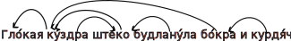

---

title: Syntactic analyzer of the Russian language based on morphology data: a functional approach
_class: lead
paginate: true
backgroundColor: #fff
<!-- backgroundImage: url('https://marp.app/assets/hero-background.svg') -->
---

# Syntactic analyzer of the Russian language based on morphology data: a functional approach

***Evgeny Cherkashin*, Natalia Sverdlova, Elena Mariasova**

_Irkutsk Scientific Center SB RAS, Irkutsk, Russia_

_Matrosov Institute for System Dynamics and Control Theory SB RAS, Irkutsk, Russia_

_Irkutsk State University, Irkutsk, Russia_


<!-- ICCS-DE 2024, Jun 1, 2024 -->

---

# Relevance of the topic

 - Partial structured documents processing: reconstruction

   - header structure
   - paragraphs
   - lists

 - Language based control of technical system
 - Data extraction from text
 - Ontology construction, knowledge acquisition
 - Natural language query subsystems for IS
 - Professional proof-based natural language translation

---

# Analogous software systems

 - Context-dependent parser (extension of CF-parsers)
 - **Dependency grammar (parsers)**
 - Content grammar
 - Homonymy removal
 - Morphological analysis
 - Link-grammar

---

# Aim of investigation

Haskell interesting properties are

- Functional programming language paradigm
- Compiler
- Lazy computations
- Class-based extensibility
- Template system support
- Parallel CPU-core programming

Aim is to **Implement list flow _probably_ one-pass syntax analyzer with Haskell**.

---

# Architecture


---

# Definition of Rules

```haskell
instance Rule GRAM where
  join :: GRAM -> (Gram -> Gram -> Bool,
                   Gram -> Bool, Gram -> Bool)
  join AdjNoun = (adjNounConsist, isAdj, isNoun)
  join NumrNoun = (numrNounConsist, isNumr, isNoun)
  join SubjVerb = (subjVerbConsist, isSubj, isVerb)
  join VerbTranObjAccs = (isAnyRel, isVerbTran, isObjAccs) -- (1)
  join NounNounGent = (isAnyRel, isNoun, isNounGent)
  join Percent = (isAnyRel, isNum100, isPercent)
  join PhoneNumber = (isAnyRel, isWord "+", isPhoneNumber)
  join Sentence = (isAnyRel, hasWall, isSentenceEnd)
  join AdvbVerb = (isAnyRel, isVerb, isAdvb)
-- . . . . . .
```

---

# Definition of Rules (continuation)

```haskell
instance Rule GRAM where
  join :: GRAM -> (Gram -> Gram -> Bool, Gram -> Bool, Gram -> Bool)
-- . . . . . .
  join AdvbVerb = (isAnyRel, isVerb, isAdvb)
-- . . . . . .
  join _ = (lfm, lf, lf)
    where lf _ = False
          lfm _ _ = False
  join3 :: (GRAM, String) ->
           (Gram -> Gram -> Bool, Gram -> Bool, Gram -> Bool)
  join3 (ForJoin, "для") = (isAnyRel, isNoun, isNounGent)
  join3 (NounInNoun, "в") = (isAnyRel, isNoun, isNounLoct)
-- . . . . . .
  join3 _ = (lfm, lf, lf)
    where lf _ = False
          lfm _ _ = False
```


---

# Data representation



---

# A primitive example

_Мама мыла раму._ (_Mother washed the window frame._)


Gramems pymorphy2 are follows (output trimmed):
мама (mother):
```
1. word='мама', 'NOUN,anim,femn sing,nomn', nf='мама', score=1.0,
```

мыла (washed):
```
1. word='мыла', 'NOUN,inan,neut sing,gent', nf='мыло', score=0.333 (soap)
2. word='мыла', 'VERB,impf,tran femn,sing,past,indc', nf='мыть', (wash)
score= 0.333
3. word='мыла', 'NOUN,inan,neut plur,nomn', nf='мыло', score=0.166 (soap)
4. word='мыла', 'NOUN,inan,neut plur,accs', nf='мыло', score=0.166 (soap)
```

раму (window frame):
```
1. word='раму', 'NOUN,inan,femn sing,accs', nf='рама', score=0.888 (frame)
2. word='раму', 'NOUN,inan,masc,Geox sing,datv', nf='рам', score=0.11 (guiding frame)
```

---

# Further development


  - Add 210 Rules from ETAP
  - Implement reverse order
  - Basic research: interpret concrete
